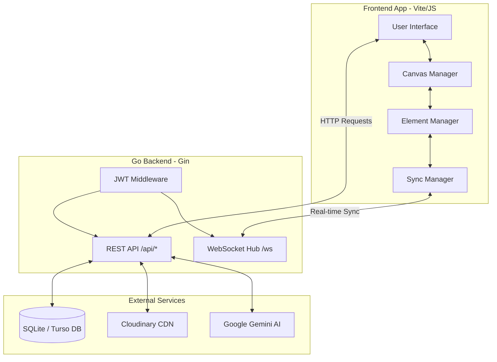
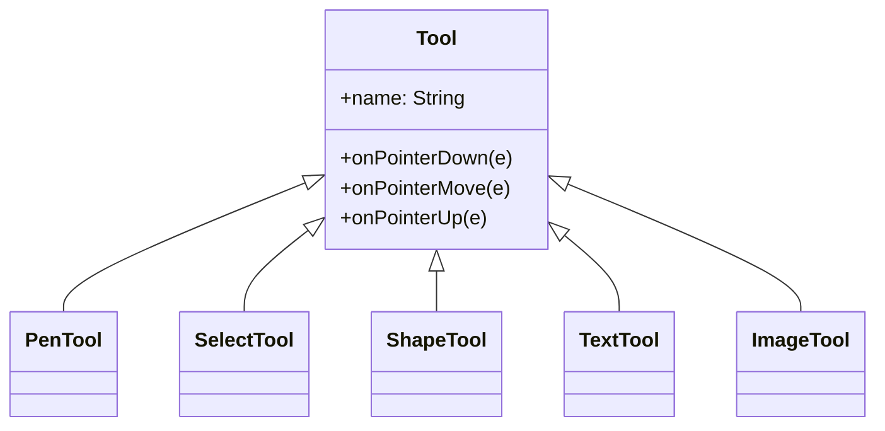

# 🏛️ CanvasFlow Architecture & Technical Decisions

Welcome to the internal architecture documentation for **CanvasFlow**, an advanced real-time collaborative whiteboard and UI builder. This document explains the high-level system design, the specific technical choices we made, and how the various subsystems interact.

---

## 1. High-Level System Architecture

CanvasFlow operates on a real-time Client-Server architecture, relying heavily on WebSocket connections to achieve low-latency collaborative synchronization.

### 🛠️ The Tech Stack

| Layer | Technology | Rationale |
| :--- | :--- | :--- |
| **Frontend** | Vanilla JS (ES6+) | Explicitly avoided heavy frameworks (React/Vue) to maintain absolute control over the render loop and achieve constant 60fps performance on the HTML5 Canvas. |
| **Backend** | Go (Golang) / Gin | Chosen for its incredible concurrency model (Goroutines) which makes managing thousands of simultaneous WebSocket connections trivial and highly efficient. |
| **Database** | SQLite / Turso | Using `modernc.org/sqlite` for cross-platform CGO-free execution, with Turso integration for optional global edge replication. |
| **Authentication** | JWT & bcrypt | Stateless JSON Web Tokens allow for highly scalable auth, protected by bcrypt password hashing. |

---

## 2. Frontend Subsystems

### 🎨 The Canvas Engine
At the core of the frontend is the `CanvasManager`. It handles:
- **High-DPI Rendering**: Automatically scaling the canvas pixel density (`window.devicePixelRatio`) to ensure text and shapes are crisp on Retina displays.
- **The Render Loop**: Instead of an infinite `requestAnimationFrame` loop which drains battery, we use a *demand-based* rendering model (`requestStaticRender`). The canvas only redraws when an element changes or the user pans/zooms.
- **Transforms**: The `Transform` object intercepts panning (via Middle Mouse/Spacebar) and zooming (Ctrl+Scroll) and updates a transformation matrix applied directly to the `CanvasRenderingContext2D`.

### 🧩 Element Management
All drawings, shapes, and UI components inherit from a base `Element` class. 
The `ElementManager` stores these in a JavaScript `Map` (for O(1) lookups) and maintains a `sortedElements` array (sorted by `zIndex`) to dictate the render order. 

> [!TIP]
> **Z-Index Strategy:** We originally defaulted `zIndex` to `0`, but this caused newer canvas strokes to hide beneath older UI elements. We resolved this by defaulting new elements to `Date.now()`, ensuring chronological top-level rendering.

### 🧰 Tool Architecture (State Pattern)
We implemented a dynamic tool system via the State Pattern. `InputHandler.js` intercepts all pointer events and forwards them to the active `Tool` subclass.

### ⏪ History & State (Undo/Redo)
The `HistoryManager` implements the **Command Pattern**. Every non-destructive action pushes a "Command" object containing an `apply()` and `revert()` function. This enables infinite, targeted undo/redo functionality that integrates perfectly with our WebSocket sync.

---

## 3. Backend Subsystems

### ⚡ WebSocket Synchronization
The real-time engine is powered by the `gorilla/websocket` package.

1. **The Hub**: Each active board spins up a virtual `Hub`. The hub maintains a registry of all active connections (`Clients`) for that specific board.
2. **Read/Write Pumps**: To prevent concurrent write panics (a common Go WebSocket pitfall), every Client has a dedicated `writePump` goroutine. Outgoing messages are sent to a Go channel, and the `writePump` safely flushes them to the socket sequentially.
3. **Conflict Resolution**: We use a Last-Write-Wins (LWW) strategy based on Lamport timestamps (`updatedAt`). When the server receives an element update, it broadcasts it to all other clients in the room.

### 🔒 REST API & Authentication
Alongside the WebSocket server, Gin serves a standard REST API:
- **JWT Middleware**: Protects board access and user data. Tokens are passed via `Authorization: Bearer <token>`.
- **Image Uploads**: We support two paths for image hosting. By default, images are saved to a local disk Volume (`/uploads`). If a `CLOUDINARY_URL` is provided, the backend calculates an SHA-1 cryptographic signature and securely uploads the image directly to the Cloudinary CDN.

### 🤖 AI Integration
The backend integrates with the Google Gemini API to offer AI-powered UI generation. When a user types a prompt (e.g., "A login screen"), the Go backend queries Gemini with a strict JSON-schema prompt. Gemini returns coordinates and element definitions, which the backend forwards to the frontend to instantly spawn interactive UI components on the canvas.

---

## 4. Security & Deployment

- **CORS Strategy**: The backend dynamically accepts configured origins, preventing unauthorized domains from hijacking the API.
- **Deployment Efficiency**: The frontend is bundled via Vite into a static `dist` folder. The Go backend is compiled into a single static binary. In production, the Go server serves the frontend `dist` files directly, allowing for a hyper-efficient, single-container deployment on platforms like Railway or AWS. 
