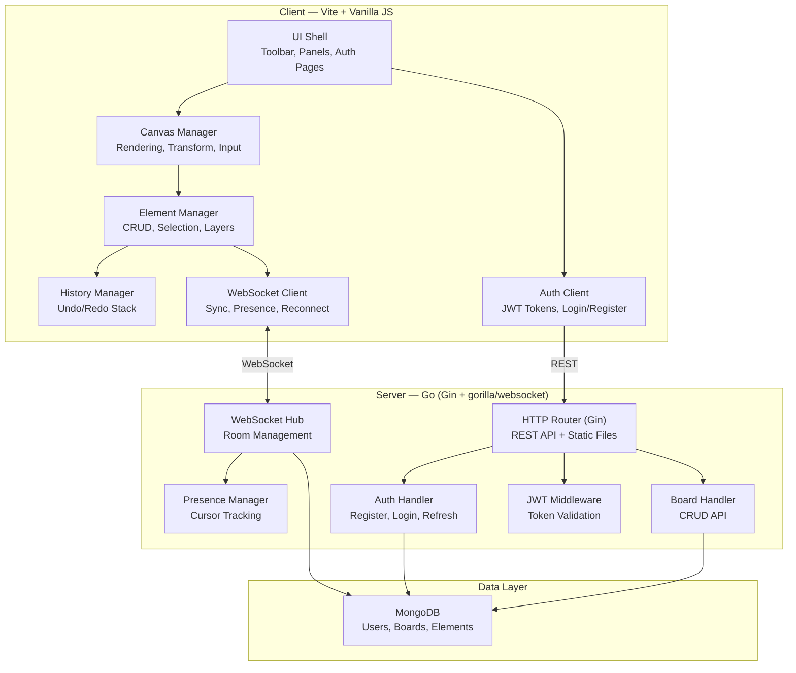
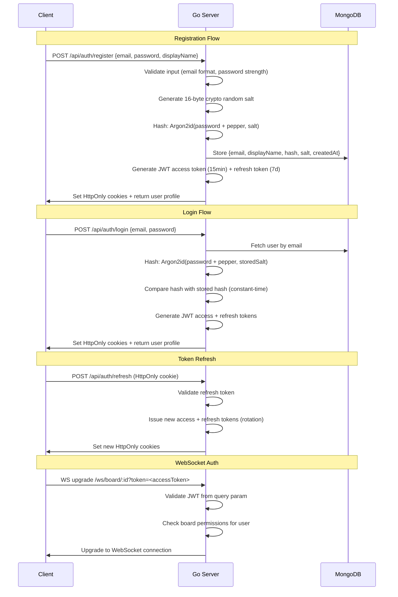

# Collaborative Whiteboard — Implementation Plan (v2)

A real-time collaborative whiteboard where multiple users can draw, place sticky notes, add shapes, and write text simultaneously. Features infinite pan/zoom canvas, cursor presence, WebSocket sync, and export to PNG/SVG/PDF.

> [!IMPORTANT]
> **Changes from v1**: Go backend (replacing Node.js), MongoDB for persistence (replacing JSON files), full JWT authentication with Argon2id + salt + pepper.

---

## Architecture Overview



---

## Tech Stack

| Layer | Technology | Rationale |
|-------|-----------|-----------|
| **Frontend** | Vite + Vanilla JS | Zero-framework overhead for canvas; max 60fps perf |
| **Styling** | Vanilla CSS | Full control, glassmorphism, dark mode |
| **Backend** | Go 1.22+ with Gin | High concurrency via goroutines, low latency WebSocket |
| **WebSocket** | `gorilla/websocket` | Industry standard Go WebSocket library |
| **Database** | MongoDB | Flexible document model fits whiteboard elements perfectly |
| **Auth** | JWT (HS256) + Argon2id | Stateless auth with modern password hashing |
| **Font** | Google Fonts (Inter) | Clean, modern typography |

---

## User Review Required

> [!IMPORTANT]
> **MongoDB Connection**: The plan is designed so you can plug in your MongoDB connection string via a `.env` file (`MONGODB_URI`). I'll use a fallback in-memory mode during development until you provide it, so we can still build and test everything.

> [!IMPORTANT]
> **Pepper Storage**: The password pepper (`AUTH_PEPPER`) will be loaded from an environment variable. This must be set before first user registration and **never changed** after, or all existing passwords become unverifiable.

---

## Authentication System — Deep Dive

### Security Architecture



### Password Hashing Details

| Parameter | Value | Purpose |
|-----------|-------|---------|
| **Algorithm** | Argon2id | Memory-hard, GPU/ASIC resistant |
| **Memory** | 64 MB | High memory cost for brute-force resistance |
| **Iterations** | 3 | Time cost parameter |
| **Parallelism** | 4 | CPU thread usage |
| **Salt Length** | 16 bytes | Unique per user, crypto/rand generated |
| **Key Length** | 32 bytes | Output hash length |
| **Pepper** | Env var `AUTH_PEPPER` | Server-side secret, prepended to password before hashing |

### JWT Token Structure

**Access Token** (15 min expiry):
```json
{
  "sub": "userId",
  "email": "user@example.com",
  "name": "Display Name",
  "iat": 1700000000,
  "exp": 1700000900,
  "jti": "unique-token-id"
}
```

**Refresh Token** (7 day expiry):
- Stored in MongoDB `refresh_tokens` collection
- Rotated on every use (old token invalidated)
- Linked to user ID and device fingerprint

---

## MongoDB Schema Design

### Collections

#### `users`
```json
{
  "_id": "ObjectId",
  "email": "user@example.com",
  "displayName": "John Doe",
  "avatarColor": "#4f8cff",
  "passwordHash": "base64-encoded-argon2id-hash",
  "passwordSalt": "base64-encoded-16-byte-salt",
  "createdAt": "ISODate",
  "updatedAt": "ISODate"
}
```
Index: `{ email: 1 }` (unique)

#### `refresh_tokens`
```json
{
  "_id": "ObjectId",
  "userId": "ObjectId",
  "tokenHash": "sha256-of-refresh-token",
  "expiresAt": "ISODate",
  "createdAt": "ISODate"
}
```
Index: `{ tokenHash: 1 }` (unique), `{ expiresAt: 1 }` (TTL)

#### `boards`
```json
{
  "_id": "ObjectId",
  "boardId": "uuid-string",
  "title": "My Board",
  "ownerId": "ObjectId",
  "collaborators": [
    { "userId": "ObjectId", "permission": "edit" | "view" }
  ],
  "shareLink": "uuid-share-token",
  "sharePermission": "edit" | "view" | "none",
  "background": "grid" | "dots" | "lines" | "blank",
  "createdAt": "ISODate",
  "updatedAt": "ISODate"
}
```
Indexes: `{ boardId: 1 }` (unique), `{ ownerId: 1 }`, `{ shareLink: 1 }`

#### `elements`
```json
{
  "_id": "ObjectId",
  "boardId": "uuid-string",
  "elementId": "uuid-string",
  "type": "freehand" | "shape" | "sticky" | "text" | "image",
  "x": 100, "y": 200,
  "width": 300, "height": 150,
  "rotation": 0,
  "zIndex": 5,
  "locked": false,
  "opacity": 1.0,
  "visible": true,
  "data": { /* type-specific data */ },
  "style": {
    "strokeColor": "#ffffff",
    "fillColor": "#4f8cff",
    "strokeWidth": 2,
    "fontSize": 16
  },
  "createdBy": "ObjectId",
  "updatedAt": 42,
  "createdAt": "ISODate"
}
```
Indexes: `{ boardId: 1, zIndex: 1 }`, `{ boardId: 1, elementId: 1 }` (unique)

---

## Project Structure

```
collabrative whighte board/
├── server/                         # Go backend
│   ├── go.mod
│   ├── go.sum
│   ├── main.go                     # Entry point, server startup
│   ├── .env.example                # Environment variable template
│   ├── config/
│   │   └── config.go               # Load env vars, app configuration
│   ├── models/
│   │   ├── user.go                 # User model + BSON tags
│   │   ├── board.go                # Board model
│   │   ├── element.go              # Element model (all types)
│   │   └── token.go                # Refresh token model
│   ├── database/
│   │   └── mongo.go                # MongoDB client singleton, collections
│   ├── auth/
│   │   ├── handler.go              # Register, Login, Refresh, Logout endpoints
│   │   ├── middleware.go           # JWT validation middleware
│   │   ├── jwt.go                  # Token generation & validation
│   │   └── password.go             # Argon2id hashing with salt+pepper
│   ├── handlers/
│   │   ├── board.go                # Board CRUD REST endpoints
│   │   ├── element.go              # Element CRUD (used by WS internally)
│   │   └── upload.go               # Image upload handler
│   ├── websocket/
│   │   ├── hub.go                  # Central Hub managing all rooms
│   │   ├── client.go               # Single WS client: read/write pumps
│   │   ├── room.go                 # Per-board room with user tracking
│   │   ├── message.go              # Message types & serialization
│   │   └── presence.go             # Cursor position broadcasting
│   ├── uploads/                    # Uploaded images (gitignored)
│   └── data/                       # Fallback JSON snapshots (dev mode)
│
├── src/                            # Frontend (Vite)
│   ├── index.html                  # Entry HTML
│   ├── main.js                     # App bootstrap & routing
│   ├── styles/
│   │   ├── index.css               # Design system, tokens, dark mode
│   │   ├── auth.css                # Login/Register page styles
│   │   ├── toolbar.css             # Toolbar styles
│   │   ├── panels.css              # Side panels
│   │   └── modals.css              # Modal dialogs
│   ├── pages/
│   │   ├── LoginPage.js            # Login form
│   │   ├── RegisterPage.js         # Registration form
│   │   ├── DashboardPage.js        # Board list + create
│   │   └── BoardPage.js            # Main whiteboard view
│   ├── auth/
│   │   └── AuthManager.js          # JWT storage, refresh, API calls
│   ├── canvas/
│   │   ├── CanvasManager.js        # Core rendering engine
│   │   ├── Transform.js            # Pan/zoom transform matrix
│   │   ├── InputHandler.js         # Mouse/touch/keyboard input
│   │   ├── GridRenderer.js         # Background grid/dots/lines
│   │   └── SelectionBox.js         # Multi-select lasso
│   ├── elements/
│   │   ├── Element.js              # Base element class
│   │   ├── FreehandElement.js      # Pen strokes
│   │   ├── ShapeElement.js         # Rect, circle, arrow, line
│   │   ├── StickyNote.js           # Colored sticky notes
│   │   ├── TextElement.js          # Text boxes
│   │   ├── ImageElement.js         # Uploaded images
│   │   └── ElementManager.js       # Collection + spatial index
│   ├── tools/
│   │   ├── Tool.js                 # Base tool interface
│   │   ├── PenTool.js              # Freehand drawing
│   │   ├── ShapeTool.js            # Shape placement
│   │   ├── StickyTool.js           # Sticky note placement
│   │   ├── TextTool.js             # Text editing
│   │   ├── SelectTool.js           # Select & transform
│   │   ├── PanTool.js              # Hand/pan tool
│   │   ├── EraserTool.js           # Eraser
│   │   └── ImageTool.js            # Image upload
│   ├── ui/
│   │   ├── Toolbar.js              # Main toolbar
│   │   ├── PropertyPanel.js        # Element properties
│   │   ├── LayerPanel.js           # Layer management
│   │   ├── UserPresence.js         # Online users display
│   │   ├── ExportModal.js          # Export dialog
│   │   ├── ShareModal.js           # Share/invite dialog
│   │   ├── TemplateModal.js        # Board templates
│   │   └── Toast.js                # Notifications
│   ├── sync/
│   │   ├── WebSocketClient.js      # WS connection + JWT auth
│   │   ├── SyncManager.js          # Operation serialization
│   │   └── PresenceSync.js         # Cursor sync
│   ├── history/
│   │   └── HistoryManager.js       # Undo/redo
│   ├── export/
│   │   ├── PNGExporter.js          # PNG export
│   │   ├── SVGExporter.js          # SVG export (vector)
│   │   └── PDFExporter.js          # PDF export
│   └── utils/
│       ├── math.js                 # Geometry helpers
│       ├── colors.js               # Color utilities
│       ├── shortcuts.js            # Keyboard shortcuts
│       └── uid.js                  # Client-side ID generation
│
├── package.json                    # Frontend dependencies (Vite)
├── vite.config.js                  # Vite config with Go server proxy
├── ARCHITECTURE.md                 # Architecture documentation
└── prompts/
    └── ai-declaration.md           # AI declaration
```

---

## Proposed Changes — Detailed

### Go Server

---

#### [NEW] server/main.go
- Initialize Gin router with CORS middleware
- Connect to MongoDB (from `MONGODB_URI` env var)
- Register route groups:
  - `/api/auth/*` — Register, Login, Refresh, Logout
  - `/api/boards/*` — Board CRUD (JWT protected)
  - `/api/upload` — Image upload (JWT protected)
  - `/ws/board/:id` — WebSocket upgrade (JWT via query param)
- Start WebSocket Hub goroutine
- Graceful shutdown with `os.Signal`

#### [NEW] server/config/config.go
- Load `.env` file using `godotenv`
- Struct: `Config { Port, MongoURI, JWTSecret, AuthPepper, UploadDir }`
- Validation: panic on missing required vars

#### [NEW] server/database/mongo.go
- Singleton `*mongo.Client` with connection pooling
- Collections: `users`, `boards`, `elements`, `refresh_tokens`
- Index creation on startup
- `Connect()`, `Disconnect()`, `GetCollection()` helpers

#### [NEW] server/auth/password.go
- `HashPassword(password, pepper string) → (hash, salt string, err)`
  - Generate 16-byte crypto/rand salt
  - Prepend pepper to password
  - Run Argon2id with params: memory=64MB, iterations=3, parallelism=4, keyLen=32
  - Return base64-encoded hash + salt
- `VerifyPassword(password, pepper, hash, salt string) → bool`
  - Rebuild hash with same params, constant-time compare

#### [NEW] server/auth/jwt.go
- `GenerateAccessToken(user) → (token string, err)`
  - Claims: sub, email, name, jti, iat, exp (15 min)
  - Sign with HS256 + `JWT_SECRET`
- `GenerateRefreshToken(user) → (token, tokenHash string, err)`
  - Opaque 32-byte random token, stored as SHA-256 hash in DB
  - 7-day expiry
- `ValidateAccessToken(tokenStr) → (claims, err)`
  - Verify signature, check expiry

#### [NEW] server/auth/handler.go
- `POST /api/auth/register` — validate, hash password, create user, issue tokens
- `POST /api/auth/login` — verify credentials, issue tokens
- `POST /api/auth/refresh` — validate refresh token, rotate, issue new pair
- `POST /api/auth/logout` — invalidate refresh token
- `GET /api/auth/me` — return current user profile (JWT protected)

#### [NEW] server/auth/middleware.go
- Extract JWT from `Authorization: Bearer <token>` header
- Validate token, inject user claims into Gin context
- Return 401 on invalid/expired token

#### [NEW] server/handlers/board.go
- `POST /api/boards` — create board, set owner
- `GET /api/boards` — list user's boards (owned + collaborated)
- `GET /api/boards/:id` — get board details + elements
- `PUT /api/boards/:id` — update board settings
- `DELETE /api/boards/:id` — delete board (owner only)
- `POST /api/boards/:id/share` — generate/update share link
- `POST /api/boards/:id/collaborators` — add collaborator by email

#### [NEW] server/handlers/upload.go
- `POST /api/upload` — multipart file upload (images only)
- Validate file type (png, jpg, gif, webp), max 10MB
- Save to `server/uploads/` with UUID filename
- Return URL path for the uploaded file

#### [NEW] server/websocket/hub.go
- Central Hub managing all rooms
- Channels: `register`, `unregister`, `broadcast`
- `Run()` goroutine: infinite select loop
- Room creation/cleanup on first join / last leave

#### [NEW] server/websocket/client.go
- `Client` struct: conn, hub, room, user, send channel
- `ReadPump()`: read messages, parse, route to room
- `WritePump()`: drain send channel, write to conn, handle ping/pong
- Read/write deadlines, message size limits

#### [NEW] server/websocket/room.go
- `Room` struct: boardId, clients map, element cache
- Handle message types: `element_create`, `element_update`, `element_delete`, `element_reorder`, `cursor_move`, `selection_change`
- Persist element changes to MongoDB (debounced, batched)
- Send full state to newly joined clients

#### [NEW] server/websocket/message.go
- Message types enum
- JSON serialization structs
- `Message { Type, Payload, UserId, Timestamp }`

#### [NEW] server/websocket/presence.go
- Track cursor positions per room
- Throttle broadcasts to ~30fps
- User join/leave notifications with avatar colors

---

### Frontend

---

#### [NEW] src/pages/LoginPage.js
- Clean dark-mode login form with glassmorphism card
- Email + password fields with validation
- "Remember me" checkbox
- Link to register page
- JWT stored via AuthManager

#### [NEW] src/pages/RegisterPage.js
- Registration form: display name, email, password, confirm password
- Password strength indicator (length, uppercase, number, symbol)
- Client-side validation before API call

#### [NEW] src/pages/DashboardPage.js
- Grid of board cards (title, thumbnail, last edited, collaborator avatars)
- "Create New Board" button + template selection
- Board actions: rename, delete, share
- Search/filter boards

#### [NEW] src/pages/BoardPage.js
- Main whiteboard view — mounts canvas, toolbar, panels
- Loads board data via REST API, connects WebSocket
- Manages tool state and active element

#### [NEW] src/auth/AuthManager.js
- Store access token in memory (not localStorage — XSS safe)
- Refresh token handled via HttpOnly cookie
- `login()`, `register()`, `logout()`, `refreshToken()`
- Auto-refresh access token before expiry
- `getAuthHeaders()` for API calls
- `isAuthenticated()` check
- Redirect to login on 401

#### Canvas, Elements, Tools, UI, Sync, History, Export
*(These remain the same as v1 plan — see below for summary)*

- **Canvas**: Dual-canvas rendering, transform matrix pan/zoom, viewport culling, grid backgrounds
- **Elements**: Freehand (pressure simulation), shapes (rect/ellipse/arrow/line), sticky notes, text, images
- **Tools**: Select, pen, shape, sticky, text, pan, eraser, image — all with keyboard shortcuts
- **UI**: Floating toolbar, property panel, layer panel, user presence, export/share/template modals, toast notifications
- **Sync**: WebSocket client with JWT auth, auto-reconnect with exponential backoff, cursor presence at 30fps, LWW conflict resolution
- **History**: Per-user undo/redo with inverse operations
- **Export**: PNG (canvas.toBlob), SVG (DOM generation), PDF (SVG-to-PDF)

---

### Styling & Design

#### [NEW] src/styles/index.css
- **Dark mode default** with CSS custom properties
- Palette: deep navy `#0a0e1a`, surface `#141825`, accent blue `#4f8cff`, vibrant gradients
- Glassmorphism: `backdrop-filter: blur(20px)`, semi-transparent panels
- Google Font: Inter (400, 500, 600, 700)
- Smooth transitions, micro-animations, custom scrollbars

#### [NEW] src/styles/auth.css
- Full-page auth layouts with animated gradient backgrounds
- Floating card with glassmorphism
- Input animations, validation states, loading spinners

---

### Documentation

#### [NEW] ARCHITECTURE.md
- System architecture diagram (client ↔ Go server ↔ MongoDB)
- Real-time sync protocol specification (WebSocket message types)
- Conflict resolution: LWW with Lamport timestamps per element property
- Authentication flow: Argon2id + JWT lifecycle
- Canvas rendering pipeline & performance optimizations

#### [NEW] prompts/ai-declaration.md
- AI tools and models used
- Development process documentation

---

## Keyboard Shortcuts

| Shortcut | Action |
|----------|--------|
| `V` | Select tool |
| `P` | Pen tool |
| `R` | Rectangle |
| `O` | Ellipse |
| `L` | Line |
| `A` | Arrow |
| `S` | Sticky note |
| `T` | Text |
| `H` / Space | Pan/Hand |
| `E` | Eraser |
| `Ctrl+Z` | Undo |
| `Ctrl+Shift+Z` | Redo |
| `Ctrl+A` | Select all |
| `Delete` | Delete selection |
| `Ctrl+D` | Duplicate |
| `[` / `]` | Send back / Bring forward |
| `Ctrl+E` | Export |
| `+` / `-` | Zoom in/out |
| `Ctrl+0` | Reset zoom |

---

## Environment Variables (.env)

```env
# Server
PORT=3001

# MongoDB
MONGODB_URI=mongodb://localhost:27017/whiteboard

# Authentication
JWT_SECRET=your-256-bit-secret-key-here
AUTH_PEPPER=your-secret-pepper-string-here

# Upload
UPLOAD_DIR=./uploads
MAX_UPLOAD_SIZE=10485760
```

---

## Implementation Order

### Phase 1 — Foundation & Auth (~35%)
1. Go project setup (go mod, Gin, gorilla/websocket)
2. MongoDB connection + models + indexes
3. Auth system: Argon2id hashing, JWT generation/validation, middleware
4. Auth endpoints: register, login, refresh, logout, me
5. Vite frontend setup with proxy to Go server
6. Login + Register pages with full validation
7. Dashboard page with board list + create

### Phase 2 — Canvas Engine (~25%)
8. Canvas rendering engine with dual-canvas setup
9. Transform matrix: pan, zoom, coordinate conversion
10. Input handler: mouse, touch, keyboard delegation
11. Grid/dots/lines background renderer
12. Element base class + freehand + shapes
13. Select tool with transform handles
14. All remaining tools (pen, sticky, text, eraser, pan, image)

### Phase 3 — Real-Time Collaboration (~25%)
15. WebSocket Hub + Room + Client architecture (Go)
16. WebSocket client (JS) with JWT auth + auto-reconnect
17. Sync protocol: element create/update/delete/reorder
18. Cursor presence: broadcast + render remote cursors
19. Board REST API: CRUD, share links, collaborator management
20. Layer panel + property panel
21. Undo/redo history

### Phase 4 — Polish & Deliverables (~15%)
22. Export: PNG, SVG, PDF
23. Template boards (brainstorming, wireframe, retro, mindmap)
24. Dark/light mode toggle
25. Share modal with permissions
26. Auto-save + reconnection recovery
27. ARCHITECTURE.md + AI declaration
28. Performance testing (1000+ elements)

---

## Verification Plan

### Automated Tests
1. **Go build**: `go build ./...` completes without errors
2. **Frontend build**: `npm run build` completes without errors
3. **Auth flow test**: Register → Login → Access protected endpoint → Refresh token → Logout
4. **Multi-tab sync test**: Open 2+ browser tabs, verify:
   - Drawing syncs between tabs in real-time
   - Cursor presence visible across tabs
   - Element CRUD syncs correctly
   - Undo/redo works per-tab independently
5. **Performance test**: Create 1000+ elements, verify smooth pan/zoom at 60fps
6. **Export test**: Export board as PNG, SVG — verify output quality
7. **Security test**: Expired JWT returns 401, invalid tokens rejected, password hash is non-reversible

### Manual Verification
- Visual inspection of UI design, animations, dark mode
- Test all drawing tools and keyboard shortcuts
- Test reconnection recovery (disconnect network, reconnect)
- Test shareable link generation and permission enforcement
- Test board collaboration: owner invites collaborator by email
