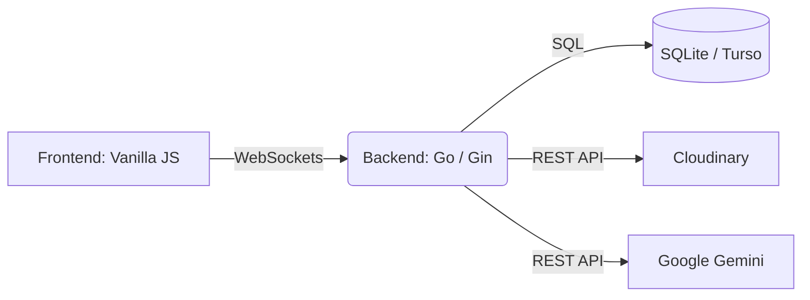

  <h1>🤖 AI Generation Declaration</h1>
  
<em>Transparency report regarding the use of Artificial Intelligence in the development of CanvasFlow.</em>

---

## 👨‍💻 Developer Overview

This project was implemented with significant architectural, coding, and debugging assistance from AI development tools. The development process functioned as an advanced pair-programming session between the human architect and the AI agent.

| Role | Details |
| :--- | :--- |
| **Agent** | Google DeepMind Antigravity AI Assistant |
| **Responsibilities** | Full Stack Development, Architecture Design, Debugging, Bug Fixing, Feature Engineering |
| **Timeline** | June 2026 |

---

## 📈 Usage Extent

The AI assistant was actively utilized across all phases of the project lifecycle:

### 1. Architecture Planning
- Designing the hybrid WebRTC + WebSocket sync model.
- Implementing the Lamport timestamp-based Last-Write-Wins (LWW) conflict resolution algorithm.
- Structuring the dual-canvas rendering architecture.
- Outlining the full feature roadmap for CanvasFlow 2.0.

### 2. Code Generation
- Generating core infrastructure code in both JavaScript (Frontend) and Go (Backend).
- Implementing all OOP element classes (Shapes, Text, Sticky Notes, UI Components).
- Building the frontend Canvas render loops and the backend Gin REST API handlers.

### 3. Debugging & Bug Fixing
- Diagnosing memory leaks in the render loop.
- Resolving infinite WebSocket reconnection loops and concurrent write panics in Go.
- Fixing canvas rendering race conditions and z-index sorting bugs.
- Tracking down cursor de-duplication logic and establishing proper Undo/Redo historical stacks.

### 4. Refactoring
- Integrating SQLite as a persistent store and retrofitting MongoDB features.
- Resolving Turso/local DB compatibility issues.
- Implementing the WebSocket fallback relay and secure Cloudinary REST API uploads using SHA-1 cryptographic signatures.

### 5. Feature Expansion (CanvasFlow 2.0)
| Feature Category | Implemented Capabilities |
| :--- | :--- |
| **Templates** | Brainstorming, Wireframe, Retrospective, Mind Map layouts. |
| **Collaboration** | Comment threads with threaded replies, author avatars, and resolve/re-open logic. |
| **Import/Export** | SVG export (vector-quality) and SVG import (shape/path/text parsing). |
| **UI Builder** | 8 canvas-rendered components: Button, Input, Card, Badge, Toggle, Dropdown, Navbar, Modal. |
| **Access Control** | Shareable public view-only links (JWT-based, 30-day expiry), Email-based collaborator invites. |
| **Customization** | Background settings (Grid, Dots, Lines, None) and Dark/Light theme toggles. |

---

## 💬 Prompts & Methodology

The assistant operated in a conversational pair-programming mode. The workflow typically involved providing a core project requirement and receiving an initial scaffold, followed by iterative requests for bug fixes, performance improvements, and feature expansions.

**A selection of the critical instructions provided to the AI:**

> 💡 *"Build a real-time collaborative whiteboard where multiple users can draw, place sticky notes, add shapes..."*

> 🐛 *"when i leave the canvas the it actually wont leave if i move cursor on dashboard it reflect on the canvas and also eraser wont work and undo feature wont work in eraser..."*

> 🛠️ *"remove mongo db completely and use turso only"*

> 🌐 *"make the canvas p2p means no server involve while working on server except saving..."*

> 🎨 *"allow user to build their app ui in this canvas also provide this features"*

---

## 🏗️ Architecture Overview

For a detailed breakdown of the technical decisions made by the AI, see the `ARCHITECTURE.md` file in the root directory. Below is a high-level summary:

All code generated by the AI has been verified, tested, and curated to ensure stability, performance, and fulfillment of the project requirements.
